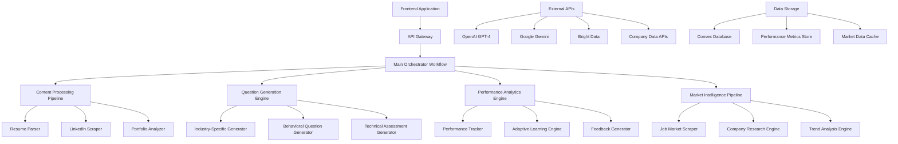

# Enhanced n8n Workflow Design Document

## Overview

The enhanced HireWise n8n workflow will transform the current basic question generation system into a comprehensive, intelligent interview preparation platform. The design leverages multiple AI models, advanced data processing, and sophisticated workflow orchestration to deliver personalized, industry-specific, and adaptive interview experiences.

The enhanced system will maintain the existing webhook-based architecture while adding multiple specialized workflows that work together to provide a seamless user experience. Each workflow will be designed for specific functionality while maintaining data consistency and performance optimization.

## Architecture

### High-Level Architecture



### Workflow Architecture

The enhanced system consists of seven interconnected workflows:

1. **Main Orchestrator Workflow** - Central coordinator that routes requests and manages workflow execution
2. **Enhanced Content Processing Workflow** - Multi-modal content analysis and extraction
3. **Intelligent Question Generation Workflow** - Advanced question generation with industry and role-specific customization
4. **Performance Analytics Workflow** - User performance tracking and adaptive learning
5. **Market Intelligence Workflow** - Real-time job market data collection and analysis
6. **Mock Interview Simulation Workflow** - Dynamic interview simulation with follow-up questions
7. **Feedback and Recommendations Workflow** - Comprehensive feedback with actionable insights

## Components and Interfaces

### 1. Main Orchestrator Workflow

**Purpose:** Central coordination and request routing

**Key Nodes:**
- Webhook receiver with enhanced payload validation
- Request classifier (determines workflow path)
- User context loader (retrieves user history and preferences)
- Workflow dispatcher (routes to appropriate sub-workflows)
- Response aggregator (combines results from multiple workflows)

**Interfaces:**
- Input: HTTP POST with user request payload
- Output: Comprehensive response with questions, analytics, and recommendations

### 2. Enhanced Content Processing Workflow

**Purpose:** Multi-modal content analysis and data extraction

**Key Nodes:**
- Content type detector (PDF, URL, text, portfolio files)
- Resume parser (enhanced with skills extraction and experience analysis)
- LinkedIn profile scraper (using Bright Data)
- Portfolio analyzer (for technical roles)
- Content synthesizer (combines data from multiple sources)
- Industry classifier (determines user's industry vertical)

**AI Models Used:**
- Google Gemini for document parsing and content extraction
- OpenAI GPT-4 for content synthesis and industry classification

**Interfaces:**
- Input: Various content types (PDF, URLs, text)
- Output: Structured user profile with skills, experience, industry, and role level

### 3. Intelligent Question Generation Workflow

**Purpose:** Advanced question generation with personalization

**Key Nodes:**
- Industry knowledge base loader
- Role-specific question templates
- Market trend integrator
- Question difficulty adjuster
- Behavioral scenario generator
- Technical challenge creator
- Question validator and formatter

**AI Models Used:**
- OpenAI GPT-4 for question generation and customization
- Custom prompt engineering for industry-specific content

**Interfaces:**
- Input: User profile, industry context, difficulty level
- Output: Categorized question sets with metadata

### 4. Performance Analytics Workflow

**Purpose:** User performance tracking and adaptive learning

**Key Nodes:**
- Performance data collector
- Skill gap analyzer
- Learning progress tracker
- Weakness identifier
- Strength reinforcement engine
- Adaptive question selector
- Performance trend calculator

**AI Models Used:**
- OpenAI GPT-4 for performance analysis and insight generation
- Custom analytics algorithms for trend analysis

**Interfaces:**
- Input: Interview responses, historical performance data
- Output: Performance metrics, improvement recommendations, adaptive question priorities

### 5. Market Intelligence Workflow

**Purpose:** Real-time job market data collection and analysis

**Key Nodes:**
- Multi-platform job scraper (LinkedIn, Indeed, Glassdoor)
- Salary data aggregator
- Skills trend analyzer
- Company culture researcher
- Market demand calculator
- Trend prediction engine

**Data Sources:**
- Bright Data for web scraping
- Public APIs for job market data
- Company review platforms

**Interfaces:**
- Input: Job title, industry, location, target companies
- Output: Market insights, trending skills, salary benchmarks, company-specific data

### 6. Mock Interview Simulation Workflow

**Purpose:** Dynamic interview simulation with intelligent follow-ups

**Key Nodes:**
- Interview session initializer
- Dynamic question selector
- Response analyzer
- Follow-up question generator
- Interview flow controller
- Session state manager
- Realistic pacing controller

**AI Models Used:**
- OpenAI GPT-4 for dynamic question generation and response analysis
- Custom logic for interview flow management

**Interfaces:**
- Input: User responses, interview context, session state
- Output: Follow-up questions, interview flow control, session analytics

### 7. Feedback and Recommendations Workflow

**Purpose:** Comprehensive feedback with actionable insights

**Key Nodes:**
- Response quality analyzer
- Communication skills assessor
- Technical accuracy evaluator
- Improvement area identifier
- Resource recommendation engine
- Benchmark comparator
- Action plan generator

**AI Models Used:**
- OpenAI GPT-4 for detailed feedback analysis
- Custom scoring algorithms for performance evaluation

**Interfaces:**
- Input: Interview responses, user profile, performance history
- Output: Detailed feedback, improvement recommendations, learning resources

## Data Models

### User Profile Model
```json
{
  "userId": "string",
  "profile": {
    "jobTitle": "string",
    "industry": "string",
    "experienceLevel": "junior|mid|senior|executive",
    "yearsOfExperience": "number",
    "skills": ["string"],
    "certifications": ["string"],
    "education": {
      "degree": "string",
      "field": "string",
      "institution": "string"
    }
  },
  "preferences": {
    "targetCompanies": ["string"],
    "targetRoles": ["string"],
    "focusAreas": ["string"]
  },
  "performanceHistory": {
    "sessions": ["sessionId"],
    "strengths": ["string"],
    "weaknesses": ["string"],
    "improvementAreas": ["string"]
  }
}
```

### Question Model
```json
{
  "questionId": "string",
  "type": "behavioral|technical|situational|industry-specific",
  "category": "string",
  "difficulty": "easy|medium|hard",
  "question": "string",
  "expectedAnswer": "string",
  "evaluationCriteria": ["string"],
  "industry": "string",
  "roleLevel": "string",
  "followUpQuestions": ["string"],
  "metadata": {
    "source": "string",
    "tags": ["string"],
    "marketRelevance": "number"
  }
}
```

### Performance Analytics Model
```json
{
  "sessionId": "string",
  "userId": "string",
  "timestamp": "datetime",
  "performance": {
    "overallScore": "number",
    "categoryScores": {
      "technical": "number",
      "behavioral": "number",
      "communication": "number"
    },
    "strengths": ["string"],
    "weaknesses": ["string"],
    "improvementAreas": ["string"]
  },
  "recommendations": {
    "practiceAreas": ["string"],
    "resources": ["string"],
    "nextSteps": ["string"]
  }
}
```

### Market Intelligence Model
```json
{
  "industry": "string",
  "jobTitle": "string",
  "marketData": {
    "demandLevel": "high|medium|low",
    "salaryRange": {
      "min": "number",
      "max": "number",
      "median": "number"
    },
    "trendingSkills": ["string"],
    "requiredSkills": ["string"],
    "emergingTrends": ["string"]
  },
  "companyInsights": {
    "culture": "string",
    "interviewStyle": "string",
    "commonQuestions": ["string"],
    "values": ["string"]
  }
}
```

## Error Handling

### Workflow-Level Error Handling
- **Timeout Management:** Each workflow has configurable timeout limits with graceful degradation
- **Retry Logic:** Automatic retry for transient failures with exponential backoff
- **Fallback Mechanisms:** Alternative data sources and simplified processing when primary systems fail
- **Error Propagation:** Structured error responses that maintain user experience

### Data Quality Assurance
- **Input Validation:** Comprehensive validation of all input data with sanitization
- **Content Verification:** AI-powered validation of extracted content accuracy
- **Response Quality Checks:** Automated quality assessment of generated questions and feedback
- **Consistency Validation:** Cross-workflow data consistency checks

### External Service Resilience
- **API Rate Limiting:** Intelligent rate limiting with queue management
- **Service Health Monitoring:** Real-time monitoring of external service availability
- **Graceful Degradation:** Reduced functionality when external services are unavailable
- **Cache Utilization:** Strategic caching to reduce external service dependencies

## Testing Strategy

### Unit Testing
- **Node-Level Testing:** Individual n8n node testing with mock data
- **AI Model Testing:** Validation of AI model responses with test datasets
- **Data Processing Testing:** Verification of data transformation accuracy
- **Error Handling Testing:** Comprehensive error scenario testing

### Integration Testing
- **Workflow Integration:** End-to-end workflow testing with realistic data
- **External Service Integration:** Testing with actual external APIs and services
- **Database Integration:** Data persistence and retrieval testing
- **Performance Integration:** Load testing with concurrent users

### User Acceptance Testing
- **Scenario-Based Testing:** Real-world interview preparation scenarios
- **Feedback Quality Assessment:** Human evaluation of generated questions and feedback
- **Performance Validation:** Verification of adaptive learning effectiveness
- **Usability Testing:** User experience validation across different user types

### Performance Testing
- **Load Testing:** High-volume request handling capability
- **Stress Testing:** System behavior under extreme conditions
- **Scalability Testing:** Performance validation with increasing user base
- **Response Time Testing:** Latency optimization and monitoring

## Security Considerations

### Data Privacy
- **PII Protection:** Secure handling of personally identifiable information
- **Data Encryption:** End-to-end encryption for sensitive data
- **Access Control:** Role-based access control for administrative functions
- **Data Retention:** Configurable data retention policies with automatic cleanup

### API Security
- **Authentication:** Secure webhook authentication with token validation
- **Rate Limiting:** Protection against abuse and DoS attacks
- **Input Sanitization:** Comprehensive input validation and sanitization
- **Audit Logging:** Detailed logging of all system interactions

### External Service Security
- **Credential Management:** Secure storage and rotation of API credentials
- **Network Security:** Encrypted communication with all external services
- **Service Validation:** Verification of external service responses
- **Compliance:** Adherence to data protection regulations (GDPR, CCPA)

## Performance Optimization

### Caching Strategy
- **Market Data Caching:** Intelligent caching of job market data with TTL management
- **User Profile Caching:** Session-based caching of user profiles and preferences
- **Question Template Caching:** Pre-generated question templates for common scenarios
- **Response Caching:** Caching of AI model responses for similar inputs

### Workflow Optimization
- **Parallel Processing:** Concurrent execution of independent workflow branches
- **Resource Pooling:** Efficient resource utilization across workflows
- **Queue Management:** Intelligent request queuing and prioritization
- **Load Balancing:** Distribution of workload across available resources

### Database Optimization
- **Query Optimization:** Efficient database queries with proper indexing
- **Data Partitioning:** Strategic data partitioning for improved performance
- **Connection Pooling:** Optimized database connection management
- **Batch Processing:** Efficient batch operations for bulk data processing